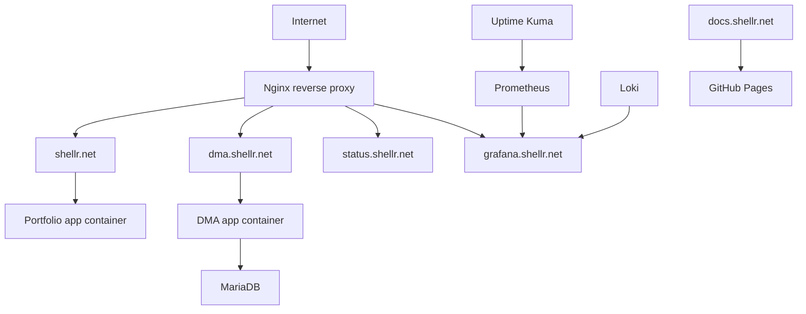

# shellr / genesis

Single-VM DevOps portfolio platform for [shellr.net](https://shellr.net).

This repository contains the platform behind `shellr.net`: a public landing page, a legacy DMA workload, reverse proxying, TLS, CI/CD, monitoring, logging, backup, and technical documentation. The goal is not to imitate enterprise scale, but to show production-like engineering decisions on a small Hetzner VM with explicit runtime boundaries.

## Live Surfaces

- `https://shellr.net` - personal landing page and platform frontdoor
- `https://dma.shellr.net` - DMA application
- `https://status.shellr.net` - public uptime and service status
- `https://docs.shellr.net` - technical documentation on GitHub Pages
- `https://grafana.shellr.net` - protected monitoring surface

## Architecture Overview



## Technical Focus

- Docker Compose runtime on a single Hetzner VM
- Nginx ingress with TLS termination and hostname-based routing
- PHP application workloads with MariaDB
- GitHub Actions deployment over SSH with health checks
- Monitoring through Prometheus, Grafana, Node Exporter, cAdvisor, and Uptime Kuma
- Logging through Loki and Promtail
- Backup and restore through database dumps, file archives, and explicit restore scripts

## Repository Layout

```text
/projects/genesis
  app/                  shellr.net landing page
  dma/                  DMA application
  infra/
    compose/            main runtime stack
    nginx/              reverse proxy and TLS config
    monitoring/         Prometheus, Grafana, Kuma, cAdvisor
    logging/            Loki and Promtail
    backup/             backup artifacts and cron definitions
  scripts/              deploy, backup, restore, and helper scripts
  docs/                 technical documentation and GitHub Pages source
```

## Getting Started

### 1. Create the required Docker networks

```bash
docker network create genesis_frontend || true
docker network create genesis_backend || true
docker network create genesis_monitoring || true
```

### 2. Prepare environment files

```bash
cp infra/compose/.env.example infra/compose/.env
cp infra/monitoring/.env.example infra/monitoring/.env
cp infra/logging/.env.example infra/logging/.env
```

Fill in real secrets before starting the platform.

### 3. Start the main platform

```bash
docker compose \
  --env-file infra/compose/.env \
  -f infra/compose/docker-compose.yml \
  up -d --build
```

### 4. Start monitoring

```bash
docker compose \
  --env-file infra/monitoring/.env \
  -f infra/monitoring/docker-compose.monitoring.yml \
  up -d
```

### 5. Start logging

```bash
docker compose \
  --env-file infra/logging/.env \
  -f infra/logging/docker-compose.logging.yml \
  up -d
```

## Documentation

- [Docs Index](/docs/README.md)
- [Projects](/docs/projects.md)
- [Architecture](/docs/architecture.md)
- [Deployment Flow](/docs/deployment-flow.md)
- [Monitoring](/docs/monitoring.md)
- [Logging](/docs/logging.md)
- [Routing and DNS](/docs/routing-dns.md)
- [Backup and Restore](/docs/backup-restore.md)
- [Lessons Learned](/docs/lessons-learned.md)
- [GitHub Pages](/docs/github-pages.md)

## Operational Notes

- `docs.shellr.net` is intentionally hosted on GitHub Pages, not on the VM
- `grafana.shellr.net` is intentionally protected and not meant to be publicly browsable
- retention is deliberately short to protect disk on a 40 GB host
- the platform is designed for maintainability and explainability over tool sprawl
