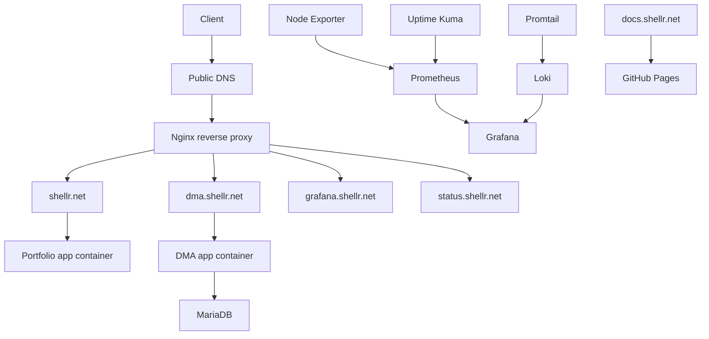

# Architecture

## Goal

Build a technically credible single-VM platform with explicit runtime boundaries, clean hostnames, and operational decisions that still make sense on a small host.

## Principles

- one VM, not a pseudo-cluster
- clear hostname separation
- Docker Compose for runtime orchestration
- bounded retention for metrics and logs
- documentation as part of the platform

## Topology

## Hostname Model

- `shellr.net` serves the personal portfolio landing page
- `www.shellr.net` redirects to `shellr.net`
- `dma.shellr.net` serves the DMA application
- `grafana.shellr.net` serves Grafana through Nginx and additional access control
- `status.shellr.net` serves Uptime Kuma
- `docs.shellr.net` is hosted on GitHub Pages and not on the VM

## Why Hostnames Instead of Subpaths

- cleaner separation between unrelated applications
- simpler cookie and session handling
- less path-rewriting complexity
- easier future migration of individual services

## Why This Fits the VM

- one reverse proxy entrypoint
- one MariaDB service
- one monitoring stack reused for metrics and logs
- no Kubernetes, no service mesh, no ELK overhead
