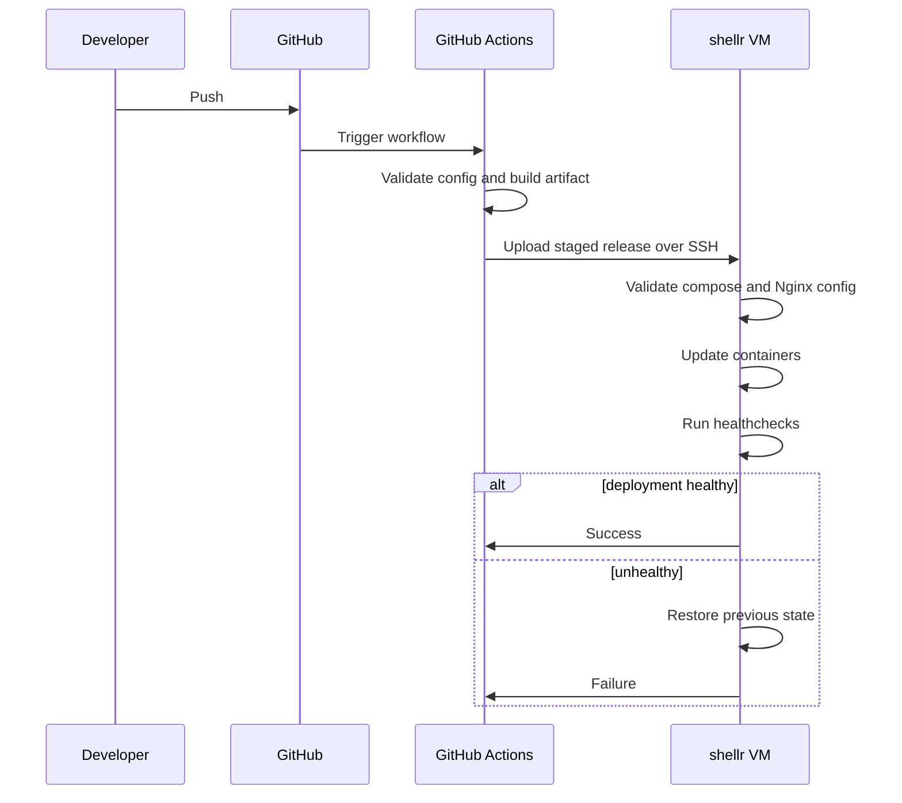

# Deployment Flow

## Goal

Keep deployment reviewable and recoverable while avoiding unnecessary CI infrastructure on the VM itself.

## Flow

## Characteristics

- staged deployment before activation
- config validation before switch
- health-gated success path
- rollback as an explicit operational step

## Documentation Publishing

Documentation is deployed separately through GitHub Pages and does not run on the VM.
